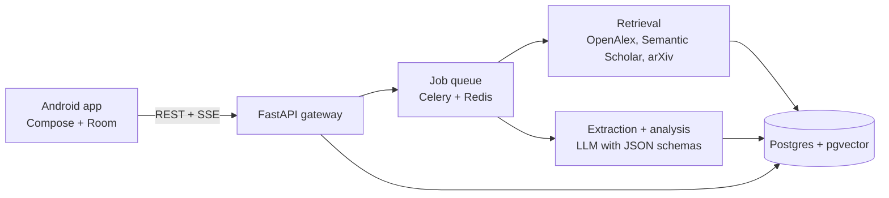
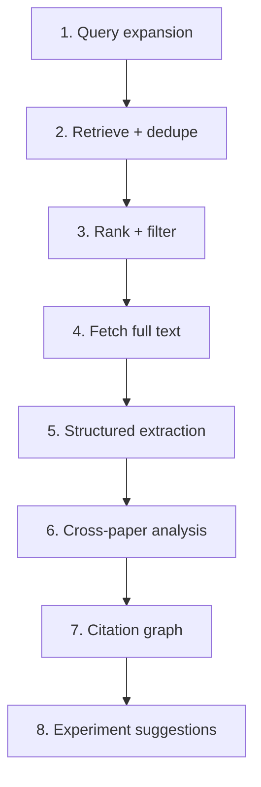
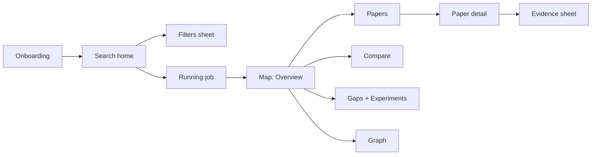

# ResearchRadar — Android Build Plan

Sep 23, 2026 · @Someone

## 1. Product scope

Build a native Android app (Kotlin + Jetpack Compose) backed by a Python server that does the retrieval and analysis. The phone never talks to an LLM directly. Every claim the app shows links back to a specific paper and passage.

**The core idea:** a topic goes in, a *research map* comes out. The map is a set of structured objects (papers, claims, metrics, gaps, edges), not a chat transcript. Users browse, filter, compare and export it.

### MVP (ship first, \~10 weeks)

| Feature | What the user sees | Why it's in MVP |
| --- | --- | --- |
| Topic search | One input, optional filters (years, venue type, min citations) | Entry point |
| Relevant papers | Ranked list with relevance reason, year, venue, citation count | Core value |
| Key findings | 2–4 extracted findings per paper, each with a quoted source sentence | Trust |
| Paper comparison | Side-by-side table: method, technology node, metrics, results | The "wow" screen |
| Tools & datasets | Grouped chips: simulators, PDKs, datasets, benchmarks, with counts | Easy win from extraction |
| Research gaps | 3–6 gaps, each backed by evidence (what's missing, which papers show it) | Differentiator |
| Library | Save topics and papers, offline read of saved maps | Retention |

### Version 2

- Citation network graph (interactive, zoomable)
- Contradiction detector (same metric, different results, with normalized units)
- Experiment suggestions (hypothesis, setup, tools, expected metric, which gap it closes)
- PDF upload of your own papers into a map
- Export to PDF / BibTeX / CSV
- Watch a topic: notify when new papers land

### What makes it not a chatbot

- No chat box on the home screen. The primary input is a topic, the primary output is structured screens.
- Every generated statement carries a citation chip and a confidence level. No citation, no display.
- Numbers are extracted into typed fields (value, unit, condition), so tables sort and compare.
- Results are cached per topic, so a second visit is instant and consistent.

## 2. Architecture and tech stack

Three layers: a thin Android client, a FastAPI backend that owns all research logic, and external paper sources. Analysis runs as a background job; the app polls or listens for progress.



The app sends a topic, gets a job id, streams progress events ("Found 42 papers", "Extracting 12/30"), then loads the finished map.

### Android client

| Concern | Choice |
| --- | --- |
| Language / UI | Kotlin, Jetpack Compose, Material 3 as a base (heavily restyled) |
| Architecture | MVVM + unidirectional data flow, `StateFlow`, one ViewModel per screen |
| Modules | `:app`, `:core:design`, `:core:network`, `:core:data`, `:feature:search`, `:feature:map`, `:feature:paper`, `:feature:compare`, `:feature:graph`, `:feature:library` |
| DI | Hilt |
| Network | Retrofit + OkHttp + Kotlinx Serialization; OkHttp SSE for progress |
| Local cache | Room (saved maps, papers) + DataStore (settings) |
| Navigation | Navigation Compose with type-safe routes |
| Images / PDFs | Coil; open PDFs via external intent or AndroidX PDF viewer |
| Graph view | Custom Compose `Canvas` with force-directed layout computed on the server |
| Auth | Firebase Auth (Google sign-in) or Supabase Auth |
| Min / target SDK | minSdk 26, target latest stable |

### Backend

| Concern | Choice |
| --- | --- |
| API | Python 3.12, FastAPI, Pydantic v2 |
| Jobs | Celery or Arq on Redis |
| Storage | Postgres + pgvector for embeddings; S3-compatible bucket for PDFs |
| Paper sources | OpenAlex (metadata, references, concepts), Semantic Scholar Graph API (citations, abstracts, open-access PDFs), arXiv API (preprints), Crossref (DOI resolution), Unpaywall (legal OA PDF links) |
| PDF parsing | GROBID (sections, references, tables) with PyMuPDF fallback |
| Embeddings | Any sentence-embedding model (e.g. SPECTER2 for scientific text) |
| LLM | Provider-agnostic wrapper; structured JSON output validated by Pydantic; retry on schema failure |
| Hosting | Render, Railway, Fly.io or a small VM; GROBID in its own container |

Check each paper API's current rate limits and key requirements before launch; request free API keys where offered.

## 3. Analysis pipeline

The pipeline is eight deterministic stages; the LLM is used only inside stages 3, 5, 6 and 8, always with a fixed JSON schema and the source text in the prompt.



| Stage | What it does | Output |
| --- | --- | --- |
| 1. Query expansion | Turns "Low-leakage SRAM using FinFET" into 4–6 keyword queries and synonyms (e.g. "FinFET SRAM standby leakage", "6T SRAM subthreshold leakage FinFET") | `queries[]` |
| 2. Retrieve + dedupe | Hits OpenAlex, Semantic Scholar and arXiv in parallel; merges by DOI, then by normalized title | 100–300 candidates |
| 3. Rank + filter | Score = 0.5 × embedding similarity to topic + 0.2 × log citations + 0.15 × recency + 0.15 × venue quality; LLM re-ranks the top 60 on abstract; keep top 20–30 | `papers[]` with `relevance_reason` |
| 4. Fetch full text | Open-access PDF via Semantic Scholar / Unpaywall / arXiv; GROBID into sections; abstract-only if no PDF (flag it) | `sections[]`, `has_full_text` |
| 5. Structured extraction | Per paper: problem, method, technology (node, device type), tools, datasets, metrics (value + unit + condition), key findings, limitations. Every field carries a quoted evidence span | `PaperExtraction` |
| 6. Cross-paper analysis | Normalizes units, builds comparison matrix, detects contradictions (same metric + similar condition, >X% disagreement), clusters limitations and missing combinations into gaps | `comparison`, `contradictions[]`, `gaps[]` |
| 7. Citation graph | Edges from OpenAlex/Semantic Scholar references among the retrieved set, plus 1-hop "foundational" papers cited by 3+ of them; layout computed server-side | `nodes[]`, `edges[]` |
| 8. Experiment suggestions | For each gap: hypothesis, setup, tools, variables, expected metric, risk; must reference the gap id and papers | `experiments[]` |

### Rules that keep it trustworthy

- **Evidence or nothing.** A finding without a verbatim quote from the source is dropped. The server checks the quote string actually exists in the paper text.
- **Units are typed.** "12.3 pW/cell at 0.6 V" becomes `{value: 12.3, unit: "pW/cell", condition: {vdd: 0.6}}`. Contradictions compare only like-for-like conditions.
- **Gaps are argued, not invented.** A gap needs a pattern (e.g. "0 of 24 papers report results below 0.5 V") plus the papers that show it.
- **Confidence label** on every generated item: High (full text, direct quote), Medium (abstract only), Low (inferred across papers).
- **Caching.** Normalized topic + filters hash → stored map. Refresh reruns only stages 2–3 and extracts new papers.

## 4. Design system: "lab notebook", not "AI app"

The app should look like a well-made scientific journal crossed with a field notebook: warm paper, black ink, one sharp accent, dense but calm tables. It earns trust by looking like a reference tool, not a magic assistant.

### Principles

1. **Content is the interface.** Titles, numbers and quotes carry the screen. Chrome (cards, shadows, icons) stays minimal.
2. **Hairlines over shadows.** Separate things with 1dp rules and whitespace, like a printed page.
3. **Numbers are first-class.** Monospace, tabular figures, right-aligned, units in a lighter weight.
4. **Show the source.** Every claim has a citation marker like `[4]` you can tap.
5. **One accent, used rarely.** The accent marks what's actionable or what's a gap. Nothing else.

### Color tokens

| Token | Light | Dark | Use |
| --- | --- | --- | --- |
| `paper` | #F6F4EF | #141311 | App background |
| `surface` | #FFFFFF | #1C1B18 | Sheets, table rows |
| `ink` | #1A1917 | #ECE8E1 | Primary text |
| `ink-2` | #5E5A53 | #A39E94 | Secondary text, metadata |
| `rule` | #DAD5CB | #34322D | Hairlines, table borders |
| `accent` | #B4441F (vermilion) | #E0714C | Gaps, primary action, selection |
| `accent-wash` | #F4E4DC | #3A2219 | Selected row, highlight behind quotes |
| `positive` | #2F6B4F | #7FC29F | "Agrees" markers |
| `conflict` | #8A5A00 | #E0B25A | Contradiction markers |

No gradients anywhere. Status is never color-only: always a word or symbol too.

### Typography

| Role | Font | Size / line height |
| --- | --- | --- |
| Display (topic title) | Newsreader or Source Serif 4, semibold | 28 / 34 sp |
| Section heading | Same serif, medium | 20 / 26 sp |
| Label (small caps feel) | IBM Plex Sans, 600, +0.08em tracking, uppercase | 11 / 16 sp |
| Body | IBM Plex Sans, regular | 15 / 22 sp |
| Paper title in lists | Serif, medium | 16 / 22 sp |
| Numbers, units, DOIs | IBM Plex Mono or JetBrains Mono, tabular | 13 / 18 sp |

All are free Google Fonts; bundle them as downloadable fonts.

### Shape, space, motion

- 4dp grid; screen gutter 20dp; list rows 16dp vertical padding.
- Corner radius: 2dp on chips, 6dp on sheets. No pill-shaped everything.
- Elevation: none on cards; only bottom sheets and menus get a shadow.
- Motion: 150–200 ms, standard easing, fades and short slides. No bouncing, no shimmer skeletons in rainbow colors (use flat `rule`-colored blocks).
- Icons: Material Symbols *Outlined*, weight 300, 20dp. No filled icons except the bookmark state.

### Signature components

| Component | Look |
| --- | --- |
| Paper row | Serif title, then a mono line: `2023 · IEEE TED · 142 cit.`; relevance reason in `ink-2`; right edge shows a small full-text / abstract-only tag |
| Citation marker | `[4]` in mono, accent color, tappable; opens a bottom sheet with paper + quoted passage |
| Evidence quote | 2dp left rule in `accent`, text in serif italic, source line underneath |
| Metric cell | `12.3` in mono ink + `pW/cell` in ink-2; condition (`@0.6 V, 25°C`) on a second line |
| Gap entry | Numbered `G1`, one-line statement, evidence line ("0 of 24 papers test below 0.5 V"), paper markers |
| Confidence tag | Text tag: `HIGH` / `MED` / `LOW` with a 3-segment bar, not a colored dot alone |
| Progress log | Monospace, time-stamped steps like a lab log: `00:04  retrieved 187 candidates` |
| Section label | Uppercase small label + hairline running to the right edge |

### Banned patterns (this is what makes apps look AI-generated)

- Purple/blue gradients, glowing orbs, sparkle ✨ icons, robot or brain illustrations
- Chat bubbles, "Ask me anything", typewriter text animation
- Glassmorphism, neon borders, heavy drop shadows
- Emoji in the UI, over-rounded 24dp+ cards, giant empty hero illustrations
- Words like "magic", "supercharge", "unlock", "AI-powered" in the UI copy
- Generic stock icons for every list item

### Copy voice

Plain and exact, like a methods section. "Found 28 papers (2016–2025). 19 with full text." not "Here's what I discovered for you!"

## 5. Screens and flows

Seventeen screens. Bottom navigation has three tabs: **Search**, **Library**, **Settings**. A finished topic opens as a *Map* with its own top tabs.



The Map tabs are: Overview · Papers · Compare · Findings · Gaps · Tools · Graph · Conflicts · Experiments (scrollable tab row).

| # | Screen | Layout and key details |
| --- | --- | --- |
| 1 | Onboarding (3 panels) | Serif statement per panel, one real example map screenshot, no illustrations. Sign in with Google at the end, skippable |
| 2 | Search home | Large serif prompt "What are you researching?", one text field with a hairline underline, 4 recent topics as text rows, 3 example topics. No chat UI |
| 3 | Filters sheet | Year range slider, field of study chips, min citations, "open-access only" switch, max papers (20/30/50) |
| 4 | Running job | Topic title on top, monospace progress log streaming stage by stage, count-ups ("187 candidates → 28 selected"), cancel button. Papers appear in a list below as they are selected |
| 5 | Map: Overview | Topic title, one-paragraph synthesis with citation markers, stat strip (papers · years · full-text · gaps · conflicts), "Top 3 gaps" preview, most-cited paper, newest paper |
| 6 | Papers | Sort (relevance / year / citations), filter by method or technology. Paper rows per the design system. Long-press to add to compare |
| 7 | Paper detail | Title, authors, venue, DOI (copy), abstract collapsible, Extraction blocks: Problem, Method, Technology, Metrics table, Findings with quotes, Limitations, Tools. "Open PDF" and "Cites / Cited by in this map" |
| 8 | Evidence sheet | Bottom sheet: exact quoted passage with section name and page, link to paper detail |
| 9 | Compare | Frozen first column (paper short name), horizontally scrollable columns: Year, Method, Node, Cell type, Leakage, SNM, Read delay, Area, Tool. Tap header to sort; units under header; best value in each column underlined in accent. Pick columns via sheet |
| 10 | Findings | Grouped by theme (e.g. "Leakage reduction techniques"), each finding a sentence + markers + confidence tag |
| 11 | Gaps | Numbered G1…Gn, each expandable: statement, evidence pattern, papers, "why it matters", linked experiment. Save/share a gap |
| 12 | Tools & datasets | Sections: Simulators, PDKs/models, Datasets/benchmarks, Hardware. Each item: name, count of papers using it, tap to filter papers |
| 13 | Graph | Canvas graph: node size = citations, color = year (sequential, single hue), edges = cites. Pinch, pan, tap node for mini card. Toggle "show only map papers". Legend at bottom |
| 14 | Conflicts | Each conflict: metric, the two (or more) values side by side with conditions, likely reason (different node, temp, Vdd), markers |
| 15 | Experiments | Card-less list: hypothesis (serif), setup, tools, variables, expected result, gap it closes, difficulty (Low/Med/High). Export as markdown |
| 16 | Library | Saved maps (with last-updated) and saved papers; works offline |
| 17 | Settings | Theme (system/light/dark), default filters, account, export, about data sources |

### States every screen must handle

- **Empty:** plain sentence + one action ("No saved maps yet. Search a topic to create one.")
- **Loading:** flat skeleton rows in `rule` color, or the progress log for jobs
- **Partial:** banner "9 of 28 papers are abstract-only; findings for them are marked MED."
- **Error:** what failed + retry ("Semantic Scholar did not respond. Results use OpenAlex only. Retry")
- **Offline:** cached maps readable; search disabled with a clear line

## 6. Data model and API contract

The backend returns one `ResearchMap` object per topic; the app stores it whole in Room and renders every tab from it.

### Core entities

| Entity | Key fields |
| --- | --- |
| `ResearchMap` | id, topic, normalized\_topic, filters, created\_at, updated\_at, stats, synthesis (text + citation ids), paper\_ids |
| `Paper` | id, doi, title, authors\[\], year, venue, citation\_count, abstract, oa\_pdf\_url, has\_full\_text, relevance\_score, relevance\_reason, short\_label ("Kim '23") |
| `PaperExtraction` | paper\_id, problem, method, technology {node\_nm, device, cell\_type}, tools\[\], datasets\[\], metrics\[\], findings\[\], limitations\[\] |
| `Metric` | name, value, unit, normalized\_value, normalized\_unit, conditions {vdd, temp\_c, corner}, evidence\_id |
| `Finding` | id, text, theme, paper\_ids\[\], evidence\_ids\[\], confidence |
| `Evidence` | id, paper\_id, quote, section, page |
| `Gap` | id (G1…), statement, pattern, supporting\_paper\_ids\[\], why\_it\_matters, confidence |
| `Contradiction` | id, metric, entries\[{paper\_id, value, unit, conditions}\], likely\_reason, confidence |
| `GraphNode` / `GraphEdge` | paper\_id, x, y, size, year, in\_map / source, target |
| `Experiment` | id, gap\_id, hypothesis, setup, tools\[\], variables\[\], expected\_result, difficulty, paper\_ids\[\] |
| `Job` | id, map\_id, status, stage, progress 0–1, log\[\] |

### Endpoints

| Method | Path | Purpose |
| --- | --- | --- |
| POST | `/v1/maps` | Body `{topic, filters}` → `{job_id, map_id}`; returns cached map immediately if fresh |
| GET | `/v1/jobs/{id}/events` | Server-sent events: `stage`, `log`, `paper_selected`, `done`, `error` |
| GET | `/v1/maps/{id}` | Full `ResearchMap` with papers, extractions, gaps, conflicts, experiments |
| GET | `/v1/maps/{id}/graph` | Nodes + edges with precomputed layout |
| GET | `/v1/papers/{id}` | Paper + extraction + evidence |
| POST | `/v1/maps/{id}/refresh` | Re-run retrieval for new papers |
| POST | `/v1/maps/{id}/export` | `{format: pdf \| bibtex \| csv \| md}` → file URL |
| GET/POST/DELETE | `/v1/library/...` | Saved maps and papers per user |

All responses are versioned, snake\_case, and validated with Pydantic on the server and Kotlinx Serialization on the client.

## 7. Build roadmap

Six phases, about 14 weeks for one or two developers. Build the backend pipeline first and test it on 5 real topics before polishing screens; the app is only as good as the map.

| Phase | Weeks | Deliverables | Done when |
| --- | --- | --- | --- |
| 0. Foundations | 1 | Repo, modules, design tokens in `:core:design`, FastAPI skeleton, Postgres, CI (lint + tests) | Empty app runs with themed Search screen in light and dark |
| 1. Retrieval | 2–3 | Query expansion, 3 source clients, dedupe, ranking, `POST /maps`, SSE progress | Top 25 papers for 5 test topics judged relevant by you |
| 2. Extraction | 4–5 | GROBID, per-paper extraction with evidence check, metrics normalization | ≥90% of shown findings have a quote that exists in the text |
| 3. Core screens | 6–8 | Search, Running job, Overview, Papers, Paper detail, Evidence sheet, Compare, Tools, Library + Room cache | Full flow works end to end on a phone; offline read of saved map |
| 4. Analysis | 9–11 | Gaps, contradictions, experiments, citation graph + Graph screen | Each gap and conflict shows its pattern and papers |
| 5. Polish + launch | 12–14 | Accessibility pass, empty/error states, export, auth, Play Store listing, closed testing | 20 testers finish a topic; crash-free rate ≥99% |

### Test topics to use throughout

1. Low-leakage SRAM using FinFET
2. Transformer models for protein structure prediction
3. Perovskite solar cell stability
4. Federated learning in healthcare privacy
5. Graph neural networks for traffic forecasting

Mixing electronics, biology, materials and CS catches pipeline assumptions that only fit one field.

## 8. Master build prompt

Paste this once at the start of a session in Claude Code, Cursor, Android Studio's agent, or similar. Then run the phase prompts in section 9 one at a time. It is long on purpose: coding agents follow specifics, not adjectives.

```text
You are a senior Android engineer and product designer. Build "ResearchRadar", a native Android app plus a Python backend.

## What the product is
ResearchRadar turns a research topic (e.g. "Low-leakage SRAM using FinFET") into a structured research map:
relevant papers, side-by-side comparison, key findings, research gaps, tools & datasets, citation network,
contradictions, and experiment suggestions. It is NOT a chatbot. There is no chat UI anywhere.
Every generated statement must link to a specific paper and a verbatim quoted passage (evidence).

## Repo layout
/android  - Kotlin, Jetpack Compose app
/backend  - Python 3.12 FastAPI service
/docs     - ARCHITECTURE.md, DESIGN.md, API.md (keep updated as you go)

## Android stack (use exactly this)
- Kotlin, Jetpack Compose, Material 3 as base but fully restyled via our own theme
- MVVM + unidirectional data flow, StateFlow, one ViewModel per screen, immutable UiState data classes
- Hilt for DI; Retrofit + OkHttp + kotlinx.serialization; OkHttp SSE for job progress
- Room for cached maps/papers; DataStore for settings
- Navigation Compose with type-safe routes
- Modules: :app, :core:design, :core:network, :core:data, :core:model,
  :feature:search, :feature:map, :feature:paper, :feature:compare, :feature:graph, :feature:library, :feature:settings
- minSdk 26. Kotlin coroutines everywhere, no RxJava. Compose previews for every component in light and dark.
- Unit tests for ViewModels and repositories; Compose UI tests for Search, Papers and Compare.

## Backend stack
- FastAPI, Pydantic v2, Postgres + pgvector, Redis + Celery (or Arq) for jobs
- Paper sources: OpenAlex, Semantic Scholar Graph API, arXiv API, Crossref, Unpaywall. Wrap each in its own client with
  retries, rate limiting, and caching. API keys come from environment variables.
- GROBID (docker) for PDF -> sections; PyMuPDF fallback.
- LLM access behind one interface `LlmClient.structured(prompt, schema) -> PydanticModel`, provider set by env var.
  Always request JSON matching a Pydantic schema; validate; retry up to 2 times on failure.
- docker-compose.yml that runs api, worker, postgres, redis, grobid.

## Pipeline (backend/app/pipeline/)
1. expand_query: topic -> 4-6 search queries + synonyms
2. retrieve: query all sources in parallel, merge by DOI then normalized title
3. rank: score = 0.5*embedding_sim + 0.2*log(citations+1) normalized + 0.15*recency + 0.15*venue;
   LLM re-rank top 60 on abstract; keep top N (default 25). Store relevance_reason (one sentence).
4. fetch_fulltext: open-access PDF only; else abstract-only and set has_full_text=false
5. extract: per paper -> problem, method, technology, tools, datasets, metrics (value, unit, conditions),
   findings, limitations. EVERY field includes evidence {quote, section, page}.
   Verify each quote is a substring of the source text (whitespace-normalized). Drop items that fail.
6. analyze: normalize units; build comparison matrix; find contradictions (same metric, comparable conditions,
   >25% disagreement); derive gaps from patterns across papers (each gap has a quantified pattern and paper ids)
7. graph: citation edges among selected papers + foundational papers cited by >=3 of them; compute layout server-side
8. experiments: 1-2 per gap: hypothesis, setup, tools, variables, expected_result, difficulty, gap_id, paper_ids
Each item gets confidence HIGH (full text + direct quote), MED (abstract only), LOW (cross-paper inference).
Emit SSE events at each stage with human-readable log lines, e.g. "retrieved 187 candidates".

## API
POST /v1/maps {topic, filters} -> {job_id, map_id} (return cached map if < 7 days old)
GET  /v1/jobs/{id}/events (SSE: stage, log, paper_selected, done, error)
GET  /v1/maps/{id}; GET /v1/maps/{id}/graph; GET /v1/papers/{id}
POST /v1/maps/{id}/refresh; POST /v1/maps/{id}/export {format: pdf|bibtex|csv|md}
Library endpoints for saved maps/papers per user. snake_case JSON. Document in docs/API.md.

## Data model
ResearchMap, Paper, PaperExtraction, Metric, Finding, Evidence, Gap, Contradiction, GraphNode, GraphEdge,
Experiment, Job. (Fields: see docs/API.md, create it from this spec.)

## DESIGN SYSTEM - "lab notebook" look. This is critical.
The app must look like a carefully typeset scientific journal / field notebook, NOT like a generic AI app.
Colors (define as tokens in :core:design, light / dark):
  paper #F6F4EF / #141311 (background), surface #FFFFFF / #1C1B18, ink #1A1917 / #ECE8E1,
  ink2 #5E5A53 / #A39E94, rule #DAD5CB / #34322D, accent #B4441F / #E0714C,
  accentWash #F4E4DC / #3A2219, positive #2F6B4F / #7FC29F, conflict #8A5A00 / #E0B25A.
Fonts (Google Fonts, bundled): Newsreader (serif) for display, headings and paper titles;
  IBM Plex Sans for UI/body; IBM Plex Mono for numbers, units, DOIs, years, citation markers.
  Type scale: display 28/34, heading 20/26, paperTitle 16/22 serif, body 15/22, label 11/16 uppercase +0.08em, mono 13/18.
  Use tabular figures for all numbers.
Layout: 4dp grid, 20dp screen gutters, list rows with 16dp vertical padding, 1dp hairline dividers in `rule`.
Shape: 2dp radius chips, 6dp radius sheets. No elevation on cards; only sheets/menus have shadow.
Icons: Material Symbols Outlined, weight 300, 20dp.
Motion: 150-200ms fades/short slides, standard easing. No bounce, no shimmer.
Signature components to build in :core:design with previews:
  PaperRow (serif title, mono meta line "2023 · IEEE TED · 142 cit.", ink2 relevance reason, FULL TEXT/ABSTRACT tag)
  CitationMarker "[4]" mono accent, tappable -> EvidenceSheet
  EvidenceQuote (2dp accent left rule, serif italic quote, source line)
  MetricCell (mono value in ink + unit in ink2, condition line below)
  GapItem (G1 numbering, statement, pattern line, markers)
  ConfidenceTag (text HIGH/MED/LOW + 3-segment bar; never color-only)
  ProgressLog (monospace timestamped lines)
  SectionLabel (uppercase label + hairline to the right edge)
  DataTable (frozen first column, horizontal scroll, sortable headers, units under headers)
BANNED: gradients, purple/blue "AI" palettes, sparkle icons, robot/brain art, chat bubbles, typewriter text,
  glassmorphism, neon, emoji, 24dp+ rounded cards, big empty illustrations, words "magic", "AI-powered",
  "supercharge", "unlock" in UI copy.
Copy voice: plain and exact like a methods section. "Found 28 papers (2016-2025). 19 with full text."

## Screens
Bottom nav: Search, Library, Settings.
1 Onboarding (3 serif statements, sign-in, skippable)
2 Search home: serif "What are you researching?", single underlined field, recent topics, example topics
3 Filters bottom sheet: year range, fields, min citations, open-access only, max papers 20/30/50
4 Running job: topic title, streaming ProgressLog, count-ups, selected papers appear below, cancel
5 Map screen with scrollable top tabs: Overview, Papers, Compare, Findings, Gaps, Tools, Graph, Conflicts, Experiments
  - Overview: synthesis paragraph with CitationMarkers, stat strip, top 3 gaps, most-cited + newest paper
  - Papers: sort/filter, PaperRows, long-press to add to compare
  - Compare: DataTable; best value per column underlined in accent; column picker sheet
  - Findings: grouped by theme, each with markers + ConfidenceTag
  - Gaps: expandable GapItems with pattern, papers, why it matters, linked experiment
  - Tools: Simulators / Models & PDKs / Datasets / Hardware with usage counts; tap filters Papers
  - Graph: Canvas-drawn graph, node size = citations, single-hue sequential color by year, pinch/pan, tap -> mini card, legend
  - Conflicts: metric, values side by side with conditions, likely reason, markers
  - Experiments: hypothesis (serif), setup, tools, variables, expected result, difficulty, linked gap; export markdown
6 Paper detail: metadata, DOI copy, collapsible abstract, extraction blocks, metrics table, findings with quotes,
  limitations, tools, open PDF, cites / cited-by within map
7 Evidence bottom sheet: quote, section, page, go to paper
8 Library: saved maps and papers, works offline
9 Settings: theme, default filters, account, export, data sources
Every screen handles empty, loading (flat skeleton rows in `rule`), partial (abstract-only banner), error (what failed + retry), and offline states.

## Accessibility
Min touch target 48dp, contrast >= 4.5:1 for text, content descriptions on all icon buttons, TalkBack labels
for citation markers ("Source 4: Kim 2023"), font scaling up to 200% without clipping.

## How to work
- Work phase by phase. At the start of each phase, write a short plan; at the end, run tests and list what's done.
- Never invent paper data in UI code. For previews use a realistic fixture file (fixtures/sram_finfet_map.json)
  with 8 papers, written as clearly fake sample data.
- Keep docs/ARCHITECTURE.md, DESIGN.md and API.md in sync with the code.
- Ask me before adding any dependency not listed here.

Start with Phase 0: create the repo structure, :core:design with all tokens, fonts and signature components
(with previews), the Search home screen, and the FastAPI skeleton with docker-compose. Then stop and summarize.
```

## 9. Follow-up prompts per phase

Send these one at a time after the master prompt, only once the previous phase works.

**Phase 1 — Retrieval**

```text
Phase 1. Implement backend pipeline stages 1-3 (expand_query, retrieve, rank) and POST /v1/maps + SSE events.
Write one client per source (OpenAlex, Semantic Scholar, arXiv) with retries, rate limits and a 24h response cache.
Dedupe by DOI, then normalized title (lowercase, strip punctuation, Levenshtein ratio > 0.92).
Add a CLI: `python -m app.cli map "Low-leakage SRAM using FinFET"` that prints the top 25 with scores and reasons.
Add pytest tests with recorded HTTP fixtures. Do not touch Android yet.
```

**Phase 2 — Extraction**

```text
Phase 2. Implement stages 4-5. Add GROBID to docker-compose. Define Pydantic schemas for PaperExtraction,
Metric, Finding, Evidence. The extraction prompt must include the paper's section text and require a verbatim quote
for every item. Implement verify_evidence(quote, text) with whitespace/hyphenation normalization; drop failures and log
the drop rate. Add a unit normalizer for common units (W, A, V, s, m, F and SI prefixes; %; dB).
Report: for the 5 test topics, % of items kept after verification.
```

**Phase 3 — Core screens**

```text
Phase 3. Build Android screens: Search home, Filters sheet, Running job (SSE ProgressLog), Map scaffold with
scrollable tabs, Overview, Papers, Paper detail, Evidence sheet, Compare (DataTable), Tools, Library.
Use only components from :core:design. Cache maps in Room; Library works offline.
For every screen implement empty/loading/partial/error/offline states. Add Compose previews using the fixture.
Then screenshot each screen in light and dark and check it against DESIGN.md's banned list. Fix any violations.
```

**Phase 4 — Analysis features**

```text
Phase 4. Backend: stages 6-8 (contradictions, gaps, citation graph with server-side force layout, experiments).
Every Gap needs a quantified pattern ("0 of 24 papers ...") and paper ids; reject gaps without them.
Android: Findings, Gaps, Conflicts, Experiments, Graph tabs. Graph drawn with Compose Canvas: pinch-zoom, pan,
tap node -> mini card; node radius from sqrt(citations); single-hue sequential color by year; legend.
Keep 60fps with 150 nodes on a mid-range device (test with a Pixel 6a emulator profile).
```

**Phase 5 — Polish and launch**

```text
Phase 5. Accessibility pass (TalkBack labels, 48dp targets, 200% font scale, contrast check). Add export
(PDF, BibTeX, CSV, Markdown), Google sign-in, crash reporting, and a Settings > Data sources page crediting
OpenAlex, Semantic Scholar, arXiv, Crossref and Unpaywall. Write Play Store listing copy in the plain "methods
section" voice. Produce a release build with R8 and a Baseline Profile.
```

**Design review prompt (run after any UI change)**

```text
Review every Compose screen against docs/DESIGN.md. List any: gradients, non-token colors, radius > 6dp, shadows on
cards, emoji, sparkle/robot icons, chat-like UI, marketing words, numbers not in mono/tabular, claims without a
CitationMarker, color-only status. Fix each and show before/after code.
```

## 10. Quality checklist and risks

The biggest risk is a confident, wrong research claim; the evidence check in stage 5 is the one feature you must not cut.

| Risk | Mitigation |
| --- | --- |
| Hallucinated findings or numbers | Verbatim quote required and substring-verified; no evidence, no display |
| Paywalled papers give thin results | Use only open-access full text; mark others abstract-only and MED confidence; show the ratio on Overview |
| Unit mismatch creates fake contradictions | Typed metrics + normalizer; compare only matching conditions; show conditions next to values |
| API rate limits / outages | Per-source caching, backoff, graceful fallback to remaining sources with a visible notice |
| LLM cost per topic | Cache by topic hash; extract each paper once and reuse across topics; cap at 25–30 papers by default |
| Slow first result (1–3 min) | Stream progress and show papers as they're selected so the wait feels useful |
| Generic, "AI-looking" UI creeping in | Run the design review prompt after every UI change |
| Copyright | Don't store or redistribute full PDFs from closed sources; link to publisher; quotes kept short |

### Launch checklist

- [ ] 5 test topics produce maps you'd trust in a literature review
- [ ] ≥90% of displayed findings pass evidence verification
- [ ] Every screen checked in light, dark, 200% font, TalkBack
- [ ] No banned design patterns (design review prompt returns clean)
- [ ] Offline Library works in airplane mode
- [ ] Crash-free sessions ≥99% in closed testing
- [ ] Data sources credited in Settings and Play listing
- [ ] Privacy policy published (needed for Play Store and Google sign-in)
